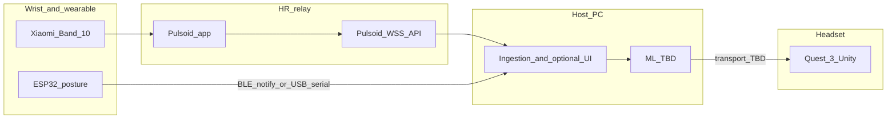

# Connecting the parts (D.U.C.K)

This document describes **how each subsystem connects**—physically, over the network, and in software—so you can wire up acquisition, a local PC dashboard, and later the Quest client. **Authoritative scope and goals** remain in [`FinalStretchDoc.md`](FinalStretchDoc.md); this file is a **connection-oriented companion**, not a replacement.

---

## Big picture

| Part | Role | Connects to |
|------|------|-------------|
| **Xiaomi Smart Band 10** | Heart rate at the wrist | Phone / Pulsoid app (see below) |
| **Pulsoid** (app + API) | Bridges HR from the band ecosystem to developer APIs | Internet → **host PC** (WebSocket) |
| **ESP32 posture wearable** | Posture state over **BLE notify** (or USB serial for debug) | **Host PC** (Bluetooth adapter + Python `bleak` helper, or serial monitor) |
| **Host PC** | Ingest, optional local dashboard, ML, forwarding | Band path via Pulsoid; serial path via USB; **TBD** link to Quest |
| **Meta Quest 3** | MR display; cameras for perception | **Host PC** (**TBD** transport: e.g. WebSockets, UDP, OSC) |

All **ML inference** stays on the **host PC**; the Quest **displays** results per [`FinalStretchDoc.md`](FinalStretchDoc.md).

---

## 1. Heart rate — Xiaomi Smart Band 10 + Pulsoid

### What you are connecting

- **Device:** Xiaomi Smart Band 10 (HR at the wrist; project scope is **HR only**—no SpO₂, sleep, or EDA from the watch in the current contract).
- **Bridge chosen for the project:** **Pulsoid** (mobile and/or desktop app per [Pulsoid](https://pulsoid.net/) setup).

### Physical / user path

1. Wear the band; ensure HR measurement is active per Xiaomi / Pulsoid setup (continuous HR or workout-style measurement as required by Pulsoid and the band).
2. Run the **Pulsoid** app on the supported device (phone or Windows) so Pulsoid can receive HR and expose it through their service.

### Developer / PC path (real-time HR on the host)

Pulsoid exposes **real-time heart rate** over a **WebSocket** API (cloud-mediated: phone/app → Pulsoid → your PC).

| Item | Detail |
|------|--------|
| **Protocol** | WebSocket (`wss`) |
| **Endpoint (documented)** | `wss://dev.pulsoid.net/api/v1/data/real_time` |
| **Auth** | OAuth2 **Bearer** token; scope **`data:heart_rate:read`** |
| **Registration** | Create API client credentials in the Pulsoid developer UI; follow [Pulsoid API documentation](https://docs.pulsoid.net/) (including OAuth and token handling). |
| **Message shape (JSON)** | Includes `measured_at` and `data.heart_rate` (see [Read heart rate via WebSocket](https://docs.pulsoid.net/read-heart-rate/read-heart-rate-via-websocket)). |
| **Libraries** | For JavaScript/TypeScript, Pulsoid documents [`@pulsoid/socket`](https://www.npmjs.com/package/@pulsoid/socket) for connection management with retries. |

**Note:** This path is **not** a purely offline LAN-only link; it assumes Pulsoid’s service is reachable. For a **fully air-gapped** HR path you would need a different bridge (out of scope for the Pulsoid-based setup).

**Verify on your PC:** after the app shows live BPM, run the small Node helper in [`telemetry/pulsoid-hr/`](../telemetry/pulsoid-hr/) (see its `README.md`) with `PULSOID_TOKEN` set to confirm the WebSocket and token.

---

## 2. Posture — ESP32 + sensor (Bluetooth LE or USB serial)

### What you are connecting

- **Hardware:** ESP32, analog posture input (e.g. flex on **GPIO 35**), vibration motor on **GPIO 25** — firmware [`arduino/posture/posture.ino`](../arduino/posture/posture.ino); wiring notes in [`arduino/README.md`](../arduino/README.md).
- **On-the-go demos (no Wi‑Fi):** use **Bluetooth Low Energy (BLE)**. The ESP32 advertises as **`DUCK Posture`** and sends the **same text lines** as serial via a **GATT notify** characteristic (no captive portals or WPA-Enterprise).

### Link A — BLE to the host PC (preferred for mobile demos)

| Item | Detail |
|------|--------|
| **Radio** | BLE only (no pairing PIN in default firmware; connect from your app) |
| **Advertised name** | `DUCK Posture` (override in sketch via `BLE_DEVICE_NAME` if needed) |
| **Service UUID** | `4fafc201-1fb5-459e-8fcc-c5c9c331914b` |
| **Notify characteristic UUID** | `beb5483e-36e1-4688-b7f5-ea07361b26a8` |
| **Payload** | UTF-8 text, same line format as serial (see below) |
| **Host helper** | [`telemetry/posture-ble/`](../telemetry/posture-ble/) — Python + [`bleak`](https://github.com/hbldh/bleak); `read_posture_ble.py` prints raw lines; **`bridge_posture.py`** parses them to JSON (stdout, JSONL file, UDP, or WebSocket broadcast) |

**Requirements:** PC Bluetooth on; Python 3.10+; `pip install -r telemetry/posture-ble/requirements.txt`. If scan by name fails (some Windows stacks omit the name), use `python read_posture_ble.py --list` to find the ESP32 address, then `--address AA:BB:...`.

**Firmware note:** The sketch uses **NimBLE** (`NimBLEDevice.h`). In Arduino ESP32 **2.x**, set **Tools → Bluetooth → NimBLE**; **3.x** uses NimBLE by default.

### Link B — USB serial (bench / debug)

- **USB cable** from the ESP32 to the **host PC** (USB-UART; install the board driver if Windows does not assign a COM port).

| Setting | Value |
|---------|--------|
| **Baud rate** | **115200** |
| **Line format** | One text line per update (`OUTPUT_INTERVAL_MS` in firmware, typically ~10 Hz) |

### Protocol (what the PC parses)

Same strings on **serial** and **BLE notify**:

- `POSTURE,good,<deviation_deg>`
- `POSTURE,slouched,<raw>,<deviation_deg>`
- `POSTURE,off,30s_bad` (device stops reporting after prolonged slouch — see firmware)

Close **Arduino Serial Monitor** before another process opens the same COM port for ingestion.

---

## 3. Host PC — ingestion and “single place to see everything”

### Responsibilities

- **Subscribe** to Pulsoid WebSocket with a valid token; parse BPM and timestamps.
- **Ingest posture** over **BLE** (Python helper) or **serial**; parse `POSTURE,...` lines; attach local receive timestamps if needed for debugging or later sync.
- Optional single-user simplifier: run [`telemetry/biometrics-fusion/`](../telemetry/biometrics-fusion/) to merge Pulsoid HR + posture into one local WebSocket feed.
- Optionally serve a **local dashboard** (e.g. `http://127.0.0.1:...`) showing HR + posture together.
- Later: **feature extraction**, ML ([`MLOptions.md`](MLOptions.md)), and **compact messages** to the Quest.

### Synchronization (for later ML)

Live streams should carry **timestamps** (Pulsoid provides `measured_at`; serial can use PC receive time or future clock sync). Windowing and alignment are discussed in [`SensorToQuestPipeline.md`](SensorToQuestPipeline.md).

---

## 4. Meta Quest 3 — display and perception path

### Connection to the host PC

- **Transport host ↔ Quest:** **TBD** in [`FinalStretchDoc.md`](FinalStretchDoc.md) (examples: WebSockets, UDP, OSC). Messages should stay **small**; interval summaries are **occasional**.
- **Unity / OpenXR:** MR app on the headset **renders** UI; **no** heavy ML on-device in the current plan.

### Facial / MorphCast

- **MorphCast** uses **Quest 3 cameras**; how **frames or features** reach the **PC** (license, latency, API) is **TBD** — track in [`FinalStretchDoc.md`](FinalStretchDoc.md) when decided.

---

## 5. Cursor and MCP (expectations)

| Tool | Use for D.U.C.K connections |
|------|---------------------------|
| **Cursor** | **IDE** to write and run your ingestion server and Unity code—not a runtime for sensors. |
| **MCP servers** | Aimed at **AI assistant tooling** (e.g. files, APIs you expose to the assistant). They do **not** replace Pulsoid, serial drivers, or Quest networking for live biometrics. Optional later: MCP around **logs** or **containers** if you containerize services. |

---

## 6. Quick reference diagram

---

## 7. When to update this file

Update **`ConnectingParts.md`** when you:

- Change the **watch** or **HR bridge** (e.g. move off Pulsoid).
- Lock **Quest ↔ PC transport** and **message schema**.
- Change **serial baud**, **BLE UUIDs/name**, or **POSTURE line format** in firmware.

Always reconcile breaking changes with [`FinalStretchDoc.md`](FinalStretchDoc.md) first.
