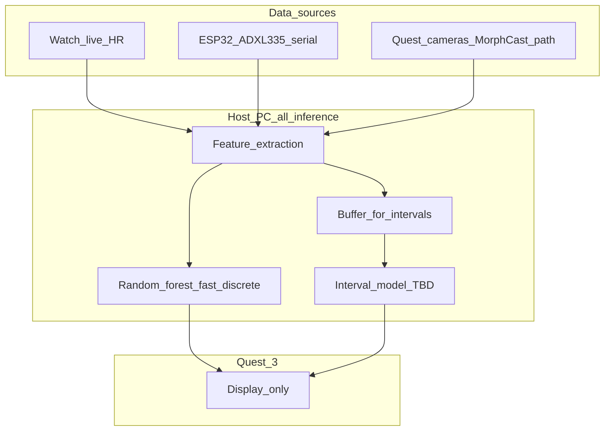

# D.U.C.K — Final stretch

## Document priority (read this first)

**This file is the prioritized specification** for what D.U.C.K is, what we are building, and what is in or out of scope. All planning, implementation, and assistant context should **start here** and treat this document as **authoritative**.

- **Other files in `docs/`** (project plans, proposals, brainstorms, summaries, older pipeline notes) are **not** co-equal sources of truth. They may be outdated, exploratory, or preserved for history. **Do not** use them to override or reinterpret what is written here unless you are deliberately migrating an idea **into** this file.
- **When scope or hardware changes, update this file first.** Other documents are optional to reconcile and are not required to stay in sync for work to proceed.
- **Disregard** narratives in older docs about LilyPad builds, voice/RNN emotion, bundled wrist sweat, CNN-on-raw-video pipelines, or a **single** MLP-only fusion model unless this file or [`MLOptions.md`](MLOptions.md) explicitly reintroduces them.

---

## What we’re building

**XR Dynamic User Context Kit (D.U.C.K)** is a mixed-reality system on **Meta Quest 3** that surfaces **real-time biomarker-related signals** so we can study how access to that information affects behavior in social and everyday settings.

**NeuroSwarm** names the long-term research direction: understanding how people change when they can perceive rich biodata about themselves and others.

---

## Current scope

### In scope

- **Heart rate:** A wrist **watch** **livestreams heart rate only**. No SpO₂, sleep, EDA/GSR, or other vitals from the watch in the current contract.
- **Posture:** Custom wearable: **ESP32**, **ADXL335** (3-axis analog accelerometer), **vibration motor**, custom circuit. Firmware lives under [`arduino/`](../arduino/).
- **Facial expression:** Third-party **[MorphCast](https://www.morphcast.com/)** with **Quest 3 cameras** for expression-related outputs. Raw capture may originate on the headset; **inference and feature use for ML run on the PC** (see Software architecture).
- **MR client:** Unity, C#, Meta SDK / OpenXR on Quest 3. UI should stay **minimal and non-overwhelming**; MVP ideal is “put on the headset and it works.”
- **Processing:** **Host PC only** for all ML and heavy inference; **Quest displays** results. See [ML inference (summary)](#ml-inference-summary) and [`MLOptions.md`](MLOptions.md).

### Out of scope

- **Voice / microphone emotion** (e.g. RNN on speech): **removed.** Do not plan or implement as part of D.U.C.K unless this file is changed.
- **Sweat / EDA / GSR from the watch:** **not** included; the watch is **HR-only** for streaming.

### Sweat / EDA (terminology only)

**EDA** (electrodermal activity), often called **GSR**, reflects **skin conductance**, often tied to stress/arousal via sweat gland activity—not the same as heart rate. A **separate** sweat/EDA sensor is **not** assumed; if it ever appears, it will be an add-on decision recorded here.

---

## Hardware snapshot

| Subsystem | What we use |
|-----------|----------------|
| Posture | ESP32 + ADXL335 + vibration motor — see [`arduino/README.md`](../arduino/README.md), [`arduino/posture.ino`](../arduino/posture.ino) |
| Watch | Live **HR** stream only; model and bridge software TBD |
| Quest 3 | MR **display**; cameras for perception pipeline; **no on-headset ML** in the current plan |

**Implementation note:** Repo comments may still mention a “flex” sensor; the **deployed** path is **ADXL335** with analog reads (e.g. **GPIO 35** for a single axis / Z-style channel — see [`arduino/accelTest/`](../arduino/accelTest/)).

**Posture serial (for reference):** **115200** baud; lines such as `POSTURE,good` or `POSTURE,slouched,<raw>` for host bridging.

---

## Software architecture

- **Quest 3:** Unity MR app — **renders** the experience; **displays** outputs from the PC (discrete labels, short text, optional future scores). **No** Random Forest, interval model, or other heavy inference on-device **for now**.
- **Host PC:** Ingests live HR (watch bridge), posture (serial or transport), and perception outputs (e.g. MorphCast-related features); runs **feature extraction**, **fast Random Forest**, and **interval-based model** per [`MLOptions.md`](MLOptions.md). Sends **compact payloads** to the Quest.
- **Transport** host ↔ Quest: **TBD** (e.g. WebSockets, UDP, OSC). Design for **small messages** and **occasional** interval summaries.

---

## ML inference (summary)

Full detail lives in [`MLOptions.md`](MLOptions.md). In short:

- **Fast path:** **Random Forest** on tabular features from biodata + perception outputs → **discrete labels** for quick, frequent feedback.
- **Interval path:** A **second ML model** on **time windows** (length **TBD**, e.g. on the order of **5–30 seconds**) → richer situational analysis; **start with simpler tabular models** on aggregated features; exact algorithm **TBD** once data exists.
- **Future (not committed):** **Continuous** arousal/stress-style scores—parked until needed.
- **Rationale:** Avoid tying “real-time helper” feel to one heavy model on every frame; keep **all** inference on the **PC**, **Quest** only **displays**.

---

## Phases

1. **Phase 1 — Validate:** Live HR from watch; stable ESP32/ADXL335 posture; MorphCast → PC feature path; fast RF + interval pipeline (even if passthrough/mock at first); MR shows PC-driven state.
2. **Phase 2 — Integrate:** One coherent MR experience: fast cues + interval summaries; polish UX.
3. **Phase 3 — Study:** NeuroSwarm direction — how biodata access changes social interaction; ethics and consent built in from the start.

---

## Ethics and data

- Informed **consent**; clear explanation of what is collected and displayed.
- **Minimize** data; **anonymize** where appropriate; treat health and social signals as sensitive.
- Keep the interface **legible and calm** — avoid overload.

---

## Open decisions (TBD)

- Watch **model** and **bridge** for live HR to the host.
- **MorphCast:** licensing, latency, how frames or features reach the PC, API shape.
- **Transport** and **schema** host → Quest (fast vs interval messages).
- **Interval window length(s)** and **interval model** choice after baselines.
- **Taxonomy** of discrete labels for fast and interval outputs.
- Whether a **separate sweat/EDA** sensor is ever planned.
- Unity project folder name (e.g. `D.U.C.K-Unity/`) and locked **Unity LTS** / **Meta SDK** versions.

---

## Data flow (conceptual)

No microphone/voice branch. No sweat/EDA from the watch. Optional future sweat sensor would feed **Feat** only if added.

---

## Other materials in the repo

Older proposals, brainstorms, literature dumps, and pipeline drafts may remain in `docs/` for **archive or reference**. They **do not** define current work. If something from those files is worth keeping, **pull it into this document** (or **`MLOptions.md`** for ML-only detail) as a deliberate decision.

---

*Update this file when scope, hardware, or goals change.*
