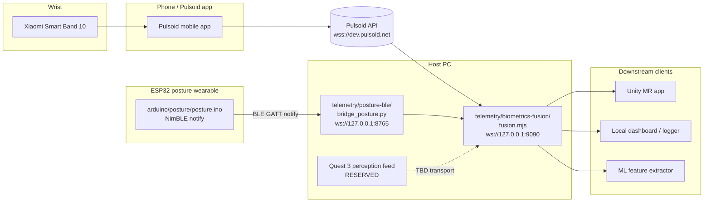

# Hub details — host PC fusion server

Single source of truth for **what the host-PC fusion hub does today**, the moving parts that feed it, and the **reserved slot** for the Meta Quest 3 / Unity perception input (MorphCast / facial expression). Scope and priorities remain authoritative in [`FinalStretchDoc.md`](FinalStretchDoc.md); network wiring context lives in [`ConnectingParts.md`](ConnectingParts.md).

---

## 1. What the hub is

The hub is a **local Node.js WebSocket server** on the host PC: [`telemetry/biometrics-fusion/fusion.mjs`](../telemetry/biometrics-fusion/fusion.mjs).

- Pulls **heart rate** from Pulsoid's cloud WebSocket.
- Pulls **posture JSON** from the local posture bridge WebSocket.
- Keeps the latest value of each signal in memory (`lastHr`, `lastPosture`).
- Broadcasts a merged JSON object to every connected downstream client.
- Downstream clients: Unity MR app on Quest 3, local dashboards, ML feature extractors, loggers — anything that can open a WebSocket.

Default endpoint: **`ws://127.0.0.1:9090/`** (localhost-first, single-user demos).

### Verified current state

As of the last run: ESP32 advertising as `DUCK Posture` at `F4:2D:C9:6B:2D:6E`; posture bridge connected and broadcasting on `ws://127.0.0.1:8765/`; Pulsoid connected and online; fusion server listening on `ws://127.0.0.1:9090/` and emitting merged events in real time.

---

## 2. Architecture



All ML inference is planned on the host PC; the Quest only **displays** results ([`FinalStretchDoc.md`](FinalStretchDoc.md)).

---

## 3. Inputs the hub consumes today

### 3.1 Heart rate — Pulsoid

| Item | Value |
|------|-------|
| Source device | Xiaomi Smart Band 10 |
| Bridge | Pulsoid mobile app → `wss://dev.pulsoid.net/api/v1/data/real_time` |
| Client library | [`@pulsoid/socket`](https://www.npmjs.com/package/@pulsoid/socket) (`v1.3+`; uses `new PulsoidSocket(token); socket.connect()`) |
| Auth | OAuth2 bearer token in `PULSOID_TOKEN` (scope `data:heart_rate:read`) |
| Events used | `open`, `online`, `offline`, `heart-rate`, `error` |
| Stored in fusion | `lastHr = { heartRate, heartMeasuredAt }` |
| Emits | merged object with `type: "hr"` on every BPM tick |

Standalone verifier: [`telemetry/pulsoid-hr/`](../telemetry/pulsoid-hr/) (`npm run hr`).

### 3.2 Posture — ESP32 over BLE

| Item | Value |
|------|-------|
| Firmware | [`arduino/posture/posture.ino`](../arduino/posture/posture.ino) (NimBLE + serial) |
| BLE advertised name | `DUCK Posture` |
| BLE service UUID | `4fafc201-1fb5-459e-8fcc-c5c9c331914b` |
| BLE notify characteristic | `beb5483e-36e1-4688-b7f5-ea07361b26a8` |
| Host bridge | [`telemetry/posture-ble/bridge_posture.py`](../telemetry/posture-ble/bridge_posture.py) |
| Bridge discovery | Python [`bleak`](https://github.com/hbldh/bleak) — scan by name or service UUID, or `--address AA:BB:...` |
| Bridge output | WebSocket broadcast on `ws://127.0.0.1:8765/` (also supports JSONL file, UDP) |
| Line protocol | `POSTURE,good,<deg>`, `POSTURE,slouched,<raw>,<deg>`, `POSTURE,off,30s_bad` |
| Stored in fusion | `lastPosture = <last bridge JSON>` |
| Emits | merged object with `type: "posture"` on every new line if `FUSION_EMIT_ON_POSTURE=1` |

### 3.3 Reserved — Quest 3 cameras / Unity (MorphCast facial expression) — **NOT YET WIRED**

Planned third input into the hub. Per [`FinalStretchDoc.md`](FinalStretchDoc.md) and [`ConnectingParts.md`](ConnectingParts.md), the Quest 3 provides camera frames processed by **[MorphCast](https://www.morphcast.com/)** on the Unity side; **tabular feature outputs** (not raw video) should reach the host PC and feed the hub alongside HR and posture.

| Item | Status |
|------|--------|
| Producer | Unity MR app on Quest 3 running MorphCast on camera frames |
| Transport Unity → host | **TBD** — candidates: WebSocket client into `fusion.mjs`, UDP datagrams, OSC, gRPC |
| Direction | **Inbound** to the fusion hub (new producer), **separate** from the outbound broadcast clients on `ws://127.0.0.1:9090/` |
| Payload shape | **TBD** — expected small JSON of per-interval MorphCast features (e.g. valence/arousal, expression probs, attention); raw video stays on device |
| Auth / trust | Localhost-only for now; move to LAN when multi-device demos are added |
| Proposed fusion fields | `lastMorphCast = { ... }`; emitted as `type: "morphcast"` alongside `hr` / `posture` |
| Open decisions | Event format, update rate, whether the Unity app pushes directly to the hub or through a small side-process (mirroring `bridge_posture.py`) |

**Where to add it in code:** fusion currently wires two upstreams (`connectPostureWs()` and `pulsoidSocket`). A third upstream (e.g. `connectMorphCastWs()` or a small inbound endpoint on the fusion server) should update a new `lastMorphCast` variable and call `broadcast(makeMerged('morphcast'))`. Reserve env vars in `.env.example` before implementation: `MORPHCAST_WS_URL`, `FUSION_EMIT_ON_MORPHCAST`.

Nothing else in the pipeline needs to change to accept MorphCast data — the output schema already has room for a `morphcast` field next to `posture`.

---

## 4. Output schema served to clients

Clients connect to `ws://127.0.0.1:9090/` and receive one JSON object per message.

```json
{
  "type": "hr",
  "ts": "2026-04-17T04:01:15.231Z",
  "heartRate": 79,
  "heartMeasuredAt": "2026-04-17T04:01:15.805Z",
  "posture": {
    "source": "posture-ble",
    "ts": "2026-04-17T04:01:15.180311+00:00",
    "raw_line": "POSTURE,good,0",
    "state": "good",
    "deviation_deg": 0
  }
}
```

| `type` | When it fires |
|--------|---------------|
| `snapshot` | Once, immediately after a client connects (latest known state) |
| `hr`       | Every Pulsoid heart-rate tick |
| `posture`  | Every posture event (if `FUSION_EMIT_ON_POSTURE=1`) |
| `morphcast` (reserved) | Every MorphCast feature update, once that upstream is wired |

Every message carries `ts` (ISO-8601 UTC) and the latest cached values for every other signal. Consumers never need to correlate two streams — the merge is done here.

---

## 5. Runtime dependencies

### 5.1 `telemetry/biometrics-fusion/` (Node.js, ESM)

From [`package.json`](../telemetry/biometrics-fusion/package.json):

| Package | Version | Purpose |
|---------|---------|---------|
| `@pulsoid/socket` | `^1.2.0` | Pulsoid real-time WebSocket client |
| `dotenv` | `^16.4.5` | Loads `.env` into `process.env` |
| `ws` | `^8.18.3` | WebSocket server for downstream clients + client to posture bridge |

Requires **Node.js LTS** on the host PC.

### 5.2 `telemetry/posture-ble/` (Python 3.10+)

From [`requirements.txt`](../telemetry/posture-ble/requirements.txt):

| Package | Version | Purpose |
|---------|---------|---------|
| `bleak` | `>=0.21.0` | Cross-platform BLE client (WinRT on Windows) |
| `websockets` | `>=12.0` | WebSocket server for `--ws-port` broadcast to fusion |

Requires **Bluetooth** enabled on the host.

### 5.3 `telemetry/pulsoid-hr/` (optional verifier)

Standalone Node helper sharing the same `@pulsoid/socket` + `dotenv` deps; used to sanity-check the token and band before starting the full hub.

### 5.4 ESP32 firmware

| Item | Value |
|------|-------|
| Board core | ESP32 Arduino core (NimBLE is default on **3.x**; on **2.x** set **Tools → Bluetooth → NimBLE**) |
| Library | `NimBLE-Arduino` by `h2zero` (Arduino Library Manager) |
| Upload baud / monitor | **115200** |
| GPIO in use | **35** analog input (ADXL335 axis), **25** vibration motor |

---

## 6. Environment variables

From [`telemetry/biometrics-fusion/.env.example`](../telemetry/biometrics-fusion/.env.example):

| Variable | Default | Purpose |
|----------|---------|---------|
| `PULSOID_TOKEN` | — (**required**) | Bearer token with `data:heart_rate:read` |
| `POSTURE_WS_URL` | `ws://127.0.0.1:8765` | Where fusion pulls posture JSON from |
| `FUSION_WS_HOST` | `127.0.0.1` | Hub bind address |
| `FUSION_WS_PORT` | `9090` | Hub port |
| `FUSION_EMIT_ON_POSTURE` | `1` | If `1`, emit on every posture event; else only on HR ticks |

Reserved (not yet used — add when MorphCast upstream is wired):

| Variable | Purpose |
|----------|---------|
| `MORPHCAST_WS_URL` | URL fusion should pull MorphCast events from (or leave empty to accept inbound only) |
| `FUSION_EMIT_ON_MORPHCAST` | If `1`, emit on every MorphCast update |

---

## 7. Run order (Windows PowerShell)

Three processes, three terminals. Start them in this order; each is long-running.

**Terminal A — posture bridge (Python):**

```powershell
cd "path\to\D.U.C.K\telemetry\posture-ble"
python bridge_posture.py --address F4:2D:C9:6B:2D:6E --ws-host 127.0.0.1 --ws-port 8765 --no-print
```

Expect: `BLE connected`, `Subscribed to notify …`, `First POSTURE line received; fan-out active.`

**Terminal B — fusion hub (Node):**

```powershell
cd "path\to\D.U.C.K\telemetry\biometrics-fusion"
npm run fusion
```

Expect: `Fusion WS server listening on ws://127.0.0.1:9090/`, `Connected to posture bridge WebSocket.`, `Pulsoid WebSocket connected.`, `Pulsoid monitor is online.`

**Terminal C — a client (sanity check):**

```powershell
cd "path\to\D.U.C.K\telemetry\biometrics-fusion"
node -e "const WS=require('ws');const s=new WS('ws://127.0.0.1:9090/');s.on('open',()=>console.log('open'));s.on('message',m=>console.log(m.toString()))"
```

Expect a `snapshot` line, then a stream of `hr` / `posture` messages.

---

## 8. How the hub will integrate Quest 3 / Unity (plan)

1. **Decide transport.** Quickest path that matches existing stack: Unity opens a **WebSocket client** to a new inbound endpoint on the host (e.g. `ws://<host-ip>:8766/`) run by a small side-process, mirroring `bridge_posture.py`. Alternative: Unity becomes a WebSocket client directly to a *second* port on `fusion.mjs` dedicated to inbound producers. Final choice is TBD in [`FinalStretchDoc.md`](FinalStretchDoc.md).
2. **Lock the payload schema.** Keep it flat (tabular features) so the Random Forest path can consume it without bespoke parsing. Include `source: "morphcast"`, `ts`, and the MorphCast feature names.
3. **Wire fusion.** Add a `connectMorphCastWs()` function (symmetric to `connectPostureWs()`), store the latest message in `lastMorphCast`, and include it in `makeMerged()`. Add `type: "morphcast"` emit behind `FUSION_EMIT_ON_MORPHCAST`.
4. **Unity consumer.** The Unity app is already a **downstream** client at `ws://<host>:9090/`. Nothing changes on that side when `morphcast` is added — it just starts seeing new messages in the same stream.
5. **Update docs.** Revisit [`ConnectingParts.md`](ConnectingParts.md) Section 4 and this file when the transport and schema are locked in.

---

## 9. Troubleshooting cheat sheet

| Symptom | Likely cause | Fix |
|---------|--------------|-----|
| Fusion prints `ECONNREFUSED 127.0.0.1:8765` | Posture bridge not running or exited | Start `bridge_posture.py` first; watch for its traceback |
| Bridge exits silently after "Connecting…" | Stale BLE session or wrong folder | Run from `telemetry/posture-ble/`; power-cycle the ESP32; check `python read_posture_ble.py --list` |
| Fusion shows `Pulsoid monitor is offline` | Phone app not sending; band not on wrist | Open Pulsoid app, start HR stream |
| Chrome tab to `ws://…` fails | Address bar doesn't speak WS; or HTTPS page blocks mixed content | Use DevTools Console on `about:blank` or an `http://` page |
| Node one-liner: `Cannot find module 'ws'` | Wrong cwd | `cd telemetry/biometrics-fusion/` first |

---

## 10. Related files

- [`docs/FinalStretchDoc.md`](FinalStretchDoc.md) — authoritative scope and hardware
- [`docs/ConnectingParts.md`](ConnectingParts.md) — wiring-level details for every subsystem
- [`docs/MLOptions.md`](MLOptions.md) — how hub output feeds Random Forest + interval model
- [`telemetry/biometrics-fusion/fusion.mjs`](../telemetry/biometrics-fusion/fusion.mjs) — hub implementation
- [`telemetry/posture-ble/bridge_posture.py`](../telemetry/posture-ble/bridge_posture.py) — posture upstream
- [`telemetry/pulsoid-hr/hr-stream.mjs`](../telemetry/pulsoid-hr/hr-stream.mjs) — Pulsoid verifier
- [`arduino/posture/posture.ino`](../arduino/posture/posture.ino) — firmware (BLE UUIDs + line protocol)

---

*Update this file when the hub adds or removes an upstream input, changes its output schema, moves off localhost, or locks the Quest 3 / MorphCast transport.*
